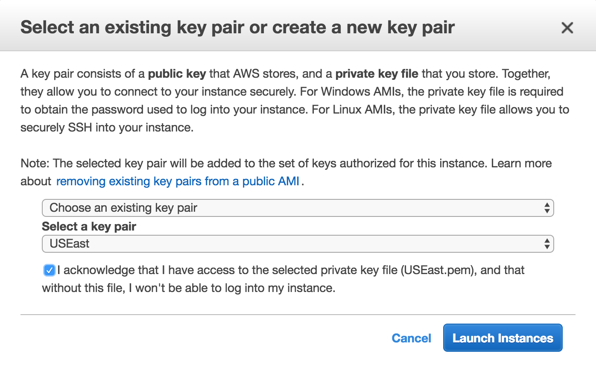

## Steps to setup MXNet environment with DL AMI on AWS

It is a simple instruction of setup MXNet environment with Deep Learning AMI on AWS.

### Launch the EC2

Login to AWS console, go the EC2 panel and select the Region you want to launch your instance.

The Deep Learning AMI is available in some of the Regions, if you want to launch your MXNet instance in a Region do not have Deep Learning AMI available, you need to create your own AMI copy of Deep Learning AMI and then copy it to the target Region you want to use. The detail steps of creating AMI and copying AMI will not be covered in this instruction. Please refer to AWS document about those operations.

Let's select the "US East(N. Virginia)" region, Deep Learning AMI is available there.

Then click "Launch Instances" button to start the wizard of creating a new EC2 instance.

In the AMI selection page, select the "Community AMIs" section, and search "Deep Learning" in this section.

There are Deep Learning AMIs based on Amazon Linux and Ubuntu Linux, select the one you prefer.

I will use the Ubuntu Linux one in this instruction.

Then you can select the instance type you want, if you want to run training model on GPU, you can select G2 instance or P2 instance. As MXNet can support CPU model, it is OK for you to select CPU instance for testing.

The following is how you select the instance type:

Click next to config instance details, in this page, you can keep all the setting as default.

In the "Add storage" page, you can add EBS volume to store your training data.

In the "Add Tags" page, add a tag with key is "Name", and the value is the name you want to give to your instance.

In the "Configure Security Group" page, add a rule to open port 9081, which we will use for Jupyter.

Then click "Luanch" button in "Review" page, there will be a pop up window to prompt you to select EC2 key pair.

Select a key pair and make sure that you have the private key of the key pair.

The click "Launch Instances" to launch the instance.

### Connect to the MXNet instance with SSH

After the instance was launched, you can see the status of the instance in the EC2 panel.

Select the EC2 instance you just created, make sure that the "Instance state" is "running" and "Status Check" is "2/2 checks passed".

Copy the public DNS name of the instance, use the following command to connect to the the instance:

	ssh -i ~/<pem file name> ubuntu@<public DNS name of the instance>
	
If you are using Amazon Linux based Deep Learning AMI, the user name should be `ec2-user`.

	
Then you can start python REPL environment, import MXNet package and try some sample codes of MXNet:

	$ python
	Python 2.7.6 (default, Oct 26 2016, 20:30:19)
	[GCC 4.8.4] on linux2
	Type "help", "copyright", "credits" or "license" for more information.
	>>> import mxnet as mx
	>>> a = mx.ndarray.ones((2,3))
	>>> a
	<NDArray 2x3 @cpu(0)>
	>>> b = mx.ndarray.ones((2,3))
	>>>
	>>> c = a*2 + b
	>>> c
	<NDArray 2x3 @cpu(0)>
	>>> c.asnumpy()
	array([[ 3.,  3.,  3.],
	       [ 3.,  3.,  3.]], dtype=float32)
	>>>

But the REPL interface is not so friendly, let's exit the python REPL environment and try to launch Jupyter.

### Use to the jupyter NoteBook

Jupyter is already installed in Deep Learning AMI, you can just start it with the following command:

	jupyter notebook --ip '*' --port <the port you want to use> --no-browser

In this instruction, we will use port 9081, so the command is:

	jupyter notebook --ip '*' --port 9081 --no-browser
	
You will see the following output:
	
	$ jupyter notebook --ip '*' --port 9081 --no-browser
	[I 08:23:32.088 NotebookApp] Writing notebook server cookie secret to /run/user/1000/jupyter/notebook_cookie_secret
	[W 08:23:32.856 NotebookApp] WARNING: The notebook server is listening on all IP addresses and not using encryption. This is not recommended.
	[I 08:23:32.869 NotebookApp] Serving notebooks from local directory: /home/ubuntu/workspace/mxnet-notebooks
	[I 08:23:32.869 NotebookApp] 0 active kernels
	[I 08:23:32.869 NotebookApp] The Jupyter Notebook is running at: http://[all ip addresses on your system]:9081/?token=1844b4b924307932839a9c81baf28b69407941052e60b8fe
	[I 08:23:32.869 NotebookApp] Use Control-C to stop this server and shut down all kernels (twice to skip confirmation).
	[C 08:23:32.869 NotebookApp]
	
	    Copy/paste this URL into your browser when you connect for the first time,
	    to login with a token:
	        http://localhost:9081/?token=xxxx

The last output is the URL you use to connect to Jupyter, you just need to replace "localhost" with the public DNS name of your EC2 instance.

If you want to stop the Jupyter server, just press `Ctr-c` twice.

And, in order to get sample codes of MXNet, you can clone the official sample notebook project of mxnet: 

	git clone https://github.com/dmlc/mxnet-notebooks.git
	
And you can clone current git project for other samples:

	git clone https://github.com/DamonDeng/mxnet_tutorial.git
	
After you clone sample project, go to the directory of the project and start Jupyter server.

Then you can access it from your browser with the following UR:

<http://Public_DNS_name_of_EC2:9081?token=xxxx>

The value of the token query string should be copied from your Jupyter server output.

The following is what you expect to see:

You are ready to run these notebooks now.

